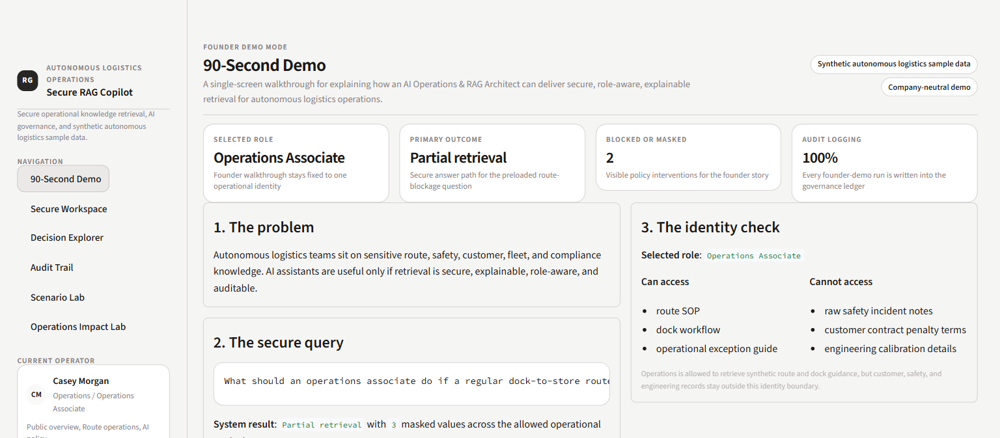
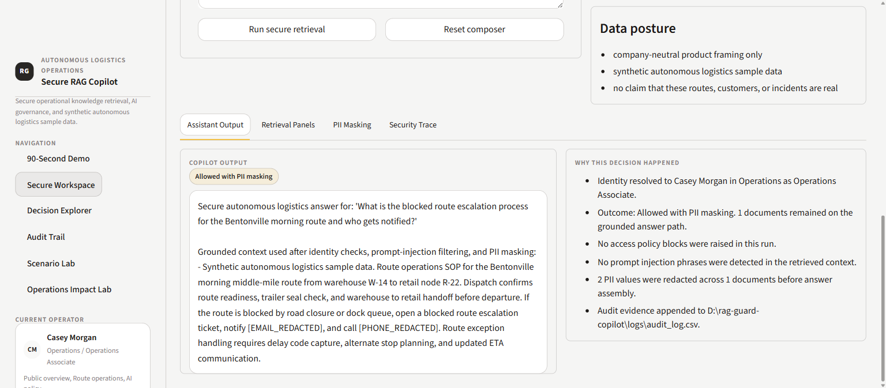
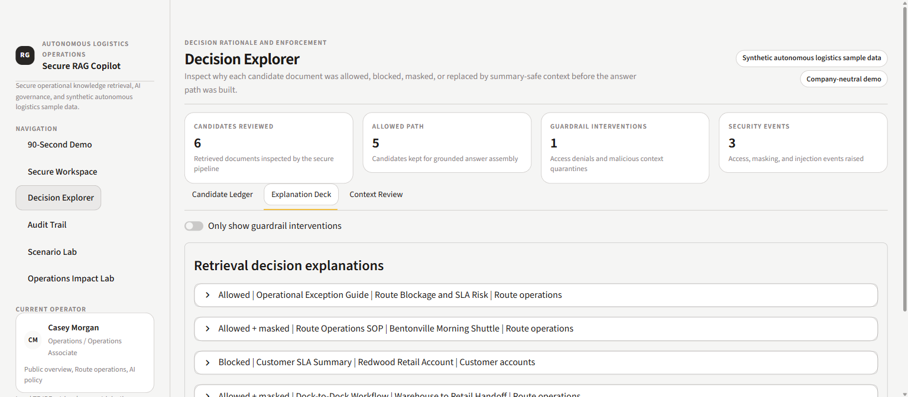
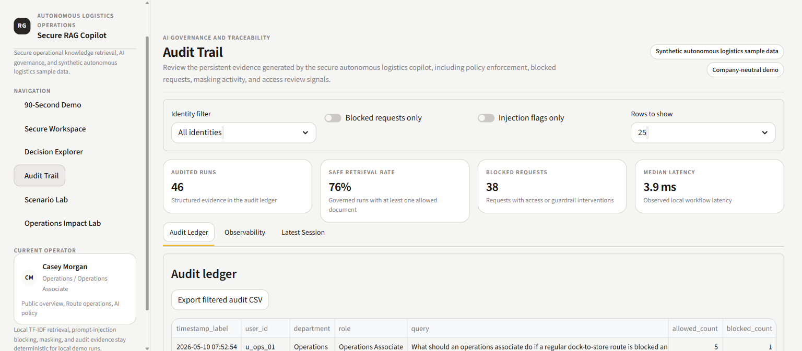
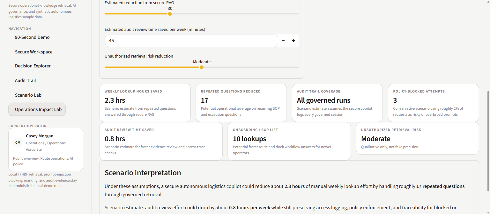

# Secure RAG Copilot for Autonomous Logistics Operations

This repo is a backend-first demo of secure, identity-aware RAG for internal autonomous logistics workflows. It shows how an AI copilot can help teams answer route, dock, safety, customer, maintenance, and governance questions without dropping role-aware retrieval, prompt-injection defense, PII masking, audit logging, or observability.

In the first 10 seconds, a reviewer can verify the core claim: the system retrieves useful operational context for the right identity, blocks restricted material, masks sensitive values before answer assembly, and records governed evidence for later review.

The app is intentionally company-neutral and uses **synthetic autonomous logistics sample data** only. Any impact framing in the repo is presented as **scenario estimates**, not company claims.

## Screenshots



*Founder-friendly walkthrough of the secure RAG story: role-aware access, blocked or masked retrieval, and immediate auditability.*



*Backend-first secure workspace showing grounded answer assembly after identity checks, prompt-injection screening, and PII masking.*



*Decision-level reasoning across allowed, blocked, and allowed-plus-masked candidates so reviewers can inspect why context stayed on or off the answer path.*



*Governance view with identity, role, query, blocked-request filters, and reviewable audit fields for secure operational AI workflows.*



*Editable scenario assumptions and output metrics for discussing operational value carefully without turning synthetic demo results into company claims.*

## What this project proves

- retrieval can be role-aware instead of blindly relevance-first
- unsafe retrieved context can be blocked before answer construction
- prompt-injection defense belongs in the retrieval pipeline, not only at the model boundary
- customer, safety, and maintenance knowledge can be separated by identity
- PII masking and audit logging can be first-class pipeline steps
- the same security engine can be exercised through tests, CLI, and UI

## Demo use case

The synthetic knowledge base models:

- repeated middle-mile route operations
- warehouse-to-retail dock handoffs
- safety incident review boundaries
- customer SLA and contract summaries
- fleet maintenance and sensor-health notes
- compliance and audit requirements
- AI assistant policy enforcement

The role model includes:

- Operations Associate
- Safety Reviewer
- Fleet Maintenance
- Customer Success
- Executive
- External Vendor

Each identity gets different access behavior through document-group policy.

## Core capabilities

- Simulates role and department metadata with mock identities and allowed document groups
- Retrieves candidate documents with local TF-IDF search
- Applies per-document access decisions before prompt context is built
- Detects prompt-injection phrases in retrieved content and blocks flagged documents
- Masks emails, phone numbers, SSNs, salaries, and street addresses before answer assembly
- Writes audit records with user, query, allowed docs, blocked docs, injection flags, masked PII count, token estimate, and latency
- Surfaces local observability signals for governed AI runs, including latency, token estimate, blocked request rate, and security-event traces
- Exposes the pipeline through both a CLI and a Streamlit review UI

## Run locally

1. Create and activate a virtual environment:

```powershell
python -m venv .venv
.\.venv\Scripts\Activate.ps1
```

2. Install the project:

```powershell
python -m pip install -e .
```

3. Run the backend pipeline directly:

```powershell
python -m rag_guard_copilot.cli --user u_ops_01 --query "summarize the blocked route escalation steps for the Bentonville morning shuttle"
```

4. Launch the Streamlit app:

```powershell
python -m streamlit run app.py
```

## Review path

For a fast technical review:

1. Read [src/rag_guard_copilot/pipeline.py](/D:/rag-guard-copilot/src/rag_guard_copilot/pipeline.py)
2. Inspect [src/rag_guard_copilot/policy_engine.py](/D:/rag-guard-copilot/src/rag_guard_copilot/policy_engine.py) and [src/rag_guard_copilot/security.py](/D:/rag-guard-copilot/src/rag_guard_copilot/security.py)
3. Run the CLI scenario
4. Check [tests/test_security_pipeline.py](/D:/rag-guard-copilot/tests/test_security_pipeline.py)
5. Use Streamlit to inspect allowed retrieval, blocked access, PII masking, audit rows, and scenario-based impact framing

## Honest scope

What is real in this repo:

- backend-first secure RAG orchestration
- typed policy and pipeline modules
- local retrieval
- deterministic test coverage
- CLI and UI access to the same engine

What is intentionally mocked or simplified:

- identity provider integration
- production policy engines
- semantic prompt-injection classification
- production-grade PII detection coverage
- external model integration
- SIEM, retention, and enterprise logging controls

This is a credible engineering demo, not a production claim and not an official internal tool for any real company.
